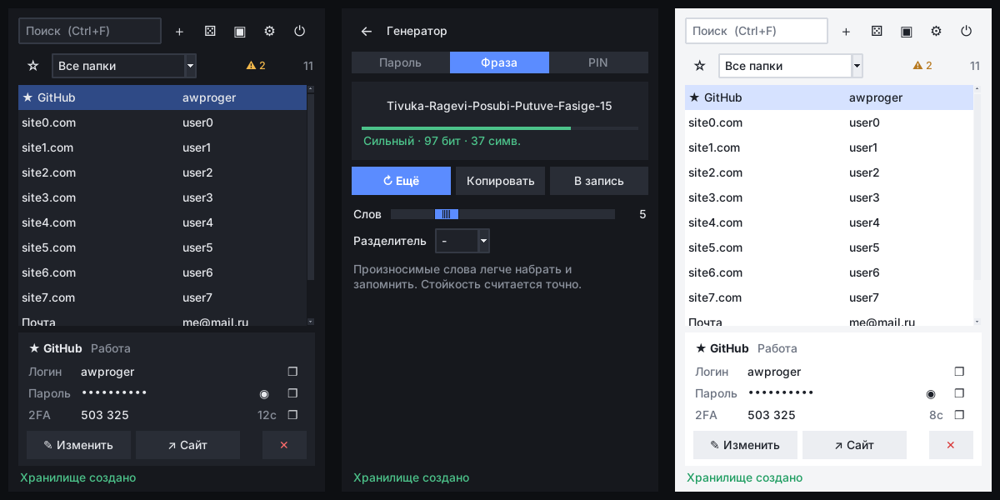

# Генератор паролей

Оффлайн-генератор и менеджер паролей. Всё считается на вашем компьютере, ничего никуда не отправляется, интернет не нужен.

Бесплатный, MIT.

---

## Скачать

Готовая программа для Windows лежит в разделе **Releases** справа на этой странице:

[⬇ Скачать последнюю версию](https://github.com/AWProger/gen_pass/releases/latest)

Распакуйте архив, запустите `.exe`. Устанавливать Python не нужно.

Если Windows покажет синее окно «Windows защитил ваш компьютер» — нажмите **Подробнее → Выполнить в любом случае**. Это стандартное поведение для программ без цифровой подписи.

---

## Что он умеет



Маленькое окно (380×580), которое удобно держать открытым весь день в углу экрана.
Кнопка ▣ закрепляет его поверх всех окон.

**Хранилище**
- Поиск по мере ввода — по названию, логину, почте, URL, заметке, папке и тегам
- Папки, теги, ★ избранное (всегда сверху)
- Карточка записи: скопировать логин, пароль, код 2FA, открыть сайт в один клик
- **Встроенные коды 2FA** (TOTP) — отдельное приложение-аутентификатор не нужно.
  Вставьте секрет или ссылку `otpauth://` из QR-кода
- История старых паролей у каждой записи
- **Проверка паролей**: слабые, повторяющиеся, не менявшиеся больше года

**Генератор**
- Пароль 8–64 символа (до 256 через код), наборы символов, без похожих `I l 1 O 0`
- Запоминаемая фраза: `Tivuka-Ragevi-Posubi-Putuve-Fasige-15` — ~97 бит, легко набрать
- PIN-код
- Стойкость в битах энтропии, а не «на глаз по длине»
- Работает и без входа в хранилище

**Безопасность**
- Всё зашифровано на вашем компьютере, ничего никуда не отправляется
- Автоблокировка после N минут без действий (по умолчанию 5) и, по желанию, при сворачивании
- Буфер обмена очищается через 30 секунд — и только если там всё ещё ваш пароль
- Резервная копия перед каждым сохранением (20 последних, папка `backups` рядом с хранилищем)
- Смена мастер-пароля

**Перенос**
- Импорт CSV из Chrome, Edge, Firefox, Bitwarden, KeePass/KeePassXC, 1Password, LastPass
- Экспорт зашифрованный (`.awpe`, свой пароль для файла) или в CSV

По умолчанию генератор не использует символы `'` `"` `` ` `` `\` — их отклоняет значительная часть сайтов.

---

## Горячие клавиши

Работают и в русской раскладке.

| Клавиши | Действие |
|---|---|
| `Ctrl+F` | поиск |
| `Enter`, двойной клик, `Ctrl+C` в списке | скопировать пароль |
| `Ctrl+B` | скопировать логин |
| `Ctrl+T` | скопировать код 2FA |
| `Ctrl+N` | новая запись |
| `Ctrl+E` | изменить запись |
| `Ctrl+D` | в избранное / убрать |
| `Delete` | удалить запись |
| `Ctrl+G` | генератор (в редакторе — новый пароль) |
| `Ctrl+S` | сохранить запись |
| `Ctrl+L` | заблокировать |
| `Esc` | назад |
| правый клик по записи | меню со всеми действиями |

Начните печатать в списке — текст сразу попадёт в поиск. `↓` из поиска переходит к списку.

---

## Как начать

1. Запустите программу
2. Придумайте **мастер-пароль**, повторите его и нажмите **Создать хранилище**
3. Нажмите **＋** — пароль для новой записи уже сгенерирован, заполните сайт и логин
4. **Сохранить** (`Ctrl+S` или `Enter`)

Мастер-пароль нигде не хранится — он нужен, чтобы открыть хранилище. **Потеряли его — восстановить пароли нельзя.** Запишите его.

Переезжаете с другого менеджера или из браузера — экспортируйте пароли там в CSV и загрузите через **⚙ → Импорт → Из CSV**. Потом удалите CSV-файл.

Файл хранилища по умолчанию: `C:\Users\<ваше_имя>\.gen_pass\vault.awp`. Другой файл — ссылка **Другой файл…** на экране входа.

---

## Как устроено шифрование

- Пароли шифруются **на вашей машине** ключом, который выводится из мастер-пароля через **scrypt** — медленный алгоритм, специально сделанный дорогим для перебора
- Каждый файл хранилища имеет собственную случайную соль
- Данные снабжены **MAC**, поэтому изменённый файл будет обнаружен, а не расшифрован в мусор
- Зашифрованный файл **не содержит** ваших паролей в читаемом виде — это можно проверить, открыв его в любом редакторе

Используется только стандартная библиотека Python: `secrets`, `hashlib`. Никаких сторонних библиотек.

---

## Что важно знать

**Пароли хранятся в открытом виде в памяти программы**, пока хранилище открыто. Поэтому оно само блокируется после 5 минут без действий (меняется в настройках). Заблокировать сразу — **⏻** или `Ctrl+L`.

**Экспорт в CSV** записывает пароли обычным текстом. Программа спросит подтверждение и предупредит.

**Буфер обмена** очищается через 30 секунд после копирования и при блокировке.

**Секрет 2FA хранится в том же хранилище, что и пароль.** Это удобно, но если кто-то узнает мастер-пароль, у него будут оба фактора. Для самых важных аккаунтов (почта, банк) можно держать 2FA в отдельном приложении.

**Резервные копии** в папке `backups` зашифрованы тем мастер-паролем, который был на момент копии. Открыть любую можно через **Другой файл…**.

**Программа не восстанавливает пароли.** Если мастер-пароль забыт, файл можно удалить и начать заново.

---

## Запуск из исходников

```bash
git clone https://github.com/AWProger/gen_pass.git
cd gen_pass
python main.py
```

Нужен Python 3.10 или новее. Зависимостей нет.

На Linux нужен tkinter: `sudo apt install python3-tk`.

Тесты:

```bash
pip install -r requirements-dev.txt
pytest
```

Тесты интерфейса открывают окно; без дисплея они пропускаются. На сервере: `xvfb-run -a pytest`.

---

## Сборка .exe самостоятельно

Нужен Windows и Python:

```bash
pip install pyinstaller
pyinstaller --noconfirm --clean gen_pass.spec
```

Готовый файл: `dist\Генератор паролей\Генератор паролей.exe`

Спецификация `gen_pass.spec` лежит в репозитории, так что сборка воспроизводима.

---

## Структура проекта

```
core.py        генерация, шифрование, хранилище, 2FA, CSV, настройки — без графики
theme.py       цвета, шрифты, свои виджеты для tkinter
ui.py          интерфейс: экраны входа, списка, редактора, генератора, проверки, настроек
main.py        точка входа, разбор аргументов
test_core.py   тесты логики
test_ui.py     тесты интерфейса (нужен дисплей или Xvfb)
gen_pass.spec  сборка .exe
```

`core.py` не зависит от tkinter, поэтому вся логика проверяется тестами без запуска окна.

---

## Частые вопросы

**Забыл мастер-пароль.** Восстановить нельзя. Это следствие того, что программа не хранит пароль нигде.

**Пароль не подходит сайту.** В генераторе снимите галочку «Все символы, включая кавычки» — или выключите символы совсем, если сайт их не принимает.

**Где взять секрет 2FA.** Когда сайт показывает QR-код для приложения-аутентификатора, рядом обычно есть ссылка «не могу отсканировать» / «ввести ключ вручную» — это и есть секрет. Вставьте его в поле «Секрет 2FA».

**Окно мешает / слишком маленькое.** Размер и положение запоминаются. Кнопка ▣ включает и выключает режим «поверх всех окон».

**Куда делся мой старый файл `.pwdb`.** Старая версия не могла прочитать собственные файлы после перезапуска: ключ шифрования создавался заново при каждом запуске. Старые файлы не восстанавливаются.

**Программа не запускается на сервере.** Это графическое приложение, ему нужен рабочий стол.

---

## Что изменилось

История версий — в [CHANGELOG.md](CHANGELOG.md).

## Лицензия

MIT — свободное использование, в том числе в коммерческих целях, при сохранении авторства. Текст лицензии в [LICENSE](LICENSE).

---

Проект открытый. Нашёл проблему, исправил или хочу помочь — [issue](https://github.com/AWProger/gen_pass/issues).